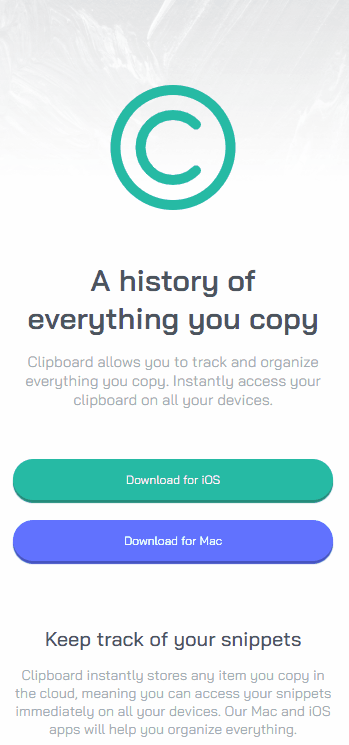

# Frontend Mentor - Solução de página de destino da área de transferência

Esta é a minha solução para o desafio [Clipboard landing page challenge on Frontend Mentor](https://www.frontendmentor.io/challenges/clipboard-landing-page-5cc9bccd6c4c91111378ecb9) do Frontend Mentor. Os desafios do Frontend Mentor ajudam a aprimorar habilidades de codificação através da criação de projetos realistas e focados em boas práticas de desenvolvimento.

## 🗂️ Índice

- [Visão Geral](#visão-geral)
  - [Capturas de Tela](#capturas-de-tela)
  - [Links](#links)
- [Meu Processo](#meu-processo)
  - [Construído com](#construído-com)
  - [O que Aprendi](#o-que-aprendi)
  - [Desenvolvimento Contínuo](#desenvolvimento-contínuo)
  - [Desafios que Encontrei](#desafios-que-enfrentei)
- [Autor](#autor)
- [Contato](#contato)

---

## Visão Geral 

### Capturas de Tela
#### Layout para Web/desktop:

  

#### Layout para tablet:

  

#### Layout para celulares:

  

### Links

- URL do site publicado: [Clique aqui](https://guilherme-ddiniz.github.io/clipboard-landing-page-master/)

---

## Meu Processo 

### Construído com

- HTML5 semântico
- CSS3 com propriedades personalizadas (CSS Variables)
- Flexbox para layout responsivo
- Fluxo de trabalho Desktop-first
- Controle de versão com Git

### O que Aprendi

- Neste projeto, aprofundei minhas habilidades em HTML e CSS, explorando novas propriedades e técnicas, como a sobreposição responsiva de imagens. Também tive a oportunidade de praticar o uso de HTML semântico, aprimorando a estrutura e acessibilidade do código.

### Desenvolvimento Contínuo

- Estou dedicado a evoluir continuamente em HTML, CSS, Git e GitHub, pois acredito que a prática constante é essencial para meu desenvolvimento profissional. Além de aplicar o que já aprendi, cada novo desafio tem se mostrado uma oportunidade valiosa para ampliar meus conhecimentos e fortalecer minhas habilidades.

---
### Desafios que Enfrentei

- O principal desafio que enfrentei foi sobrepor corretamente as imagens do cabeçalho e manter a imagem do monitor cortada, conforme proposto pelo designer, garantindo que tudo se adaptasse de forma responsiva.

## Autor

- GitHub - [Guilherme-dDiniz](https://github.com/Guilherme-dDiniz)
- Frontend Mentor - [@Guilherme-dDiniz](https://www.frontendmentor.io/profile/Guilherme-dDiniz)
